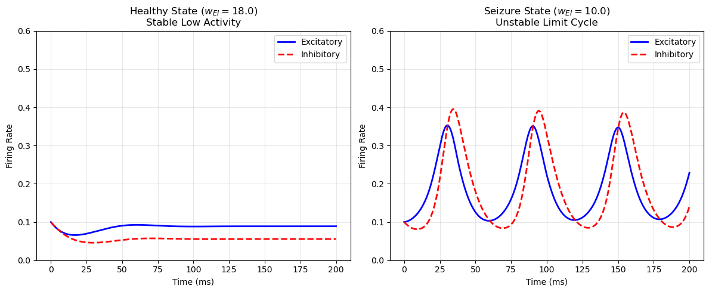
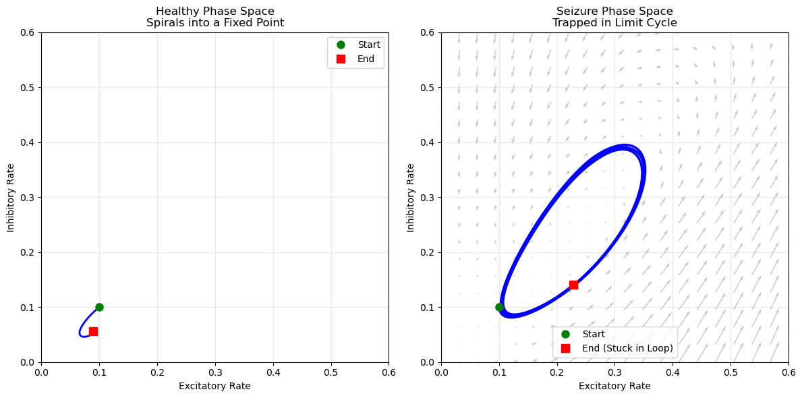
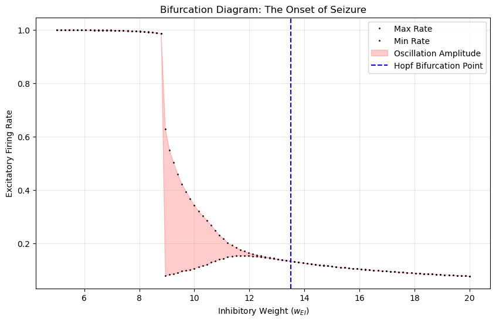

# Computational Neuroscience Projects 
This repository features a collection of projects exploring neural dynamics, spectral analysis, and stimulus decoding using various computational methods.

## Projects Overview
## 1. Neural Decoding in the Allen Visual Behavior Dataset (March 2025)
This Neuromatch tutorial project contains a computational analysis pipeline designed to dissect how behavioral states such as locomotion, task engagement, and novelty reshape neural coding in the mouse visual cortex. Using the Allen Brain Observatory dataset, I've modeled the interaction between behavioral variables and cell-type specific neural dynamics.
#### Aims:

### *In this project we focused on answering these 4 questions:*
#### Engagement Effects (Q5): How does active task performance alter the "gain" that running typically provides to visual neurons?  
#### Novelty & Behavior (Q6): Can neural changes observed during novel stimulus sessions be explained by shifts in behavioral state (e.g., freezing)?  
#### Cell-Type Specificity (Q7): Do different inhibitory classes (SST, VIP) respond differently to behavioral state changes?  
#### Circuit Interaction Models (Q8): What is the functional relationship between Excitatory, SST, and VIP populations during visual processing?    
  
*Data provided by the Allen Institute for Brain Science (2023). Visual Behavior 2P Project. Available from: portal.brain-map.org*

## 2. Seizure Dynamics via Wilson-Cowan Modeling (December 2024)
This project utilizes **Dynamical Systems Theory** to simulate the interactions between excitatory and inhibitory neural populations. By mathematically modeling the "Edge of Chaos," we investigate how subtle changes in synaptic inhibition can drive a neural network from a healthy, stable state into the pathological oscillations characteristic of an epileptic seizure.  
#### Focus:  Investigating neural stability and the "Edge of Chaos" using dynamical systems theory.
#### Methodology:   Implementation of coupled differential equations (Runge-Kutta method) to model excitatory-inhibitory (E-I) interactions.  
#### Analysis:  Transitioned the system from a Stable Fixed Point (healthy state) to a Limit Cycle Attractor (seizure state) by perturbing inhibitory synaptic weights ($w_{EI}$).  
#### Criticality Mapping:  Constructed a Bifurcation Diagram to identify the Hopf Bifurcation point where neural stability is lost.  

 
### 3. EEG Spectral Analysis of Alpha Rhythms (December 2024)
#### Focus: Investigating visual cortex alpha rhythms (8-12 Hz) across eyes-open and eyes-closed states.  
#### Goal: Testing the "cortical idling" hypothesis where alpha power increases during eyes-closed states.  

note: "cortical idling" hypothesis has been long rejected and mothern view of "inhibition" is now the dominant view; this means that the brain uses alpha oscillations to actively suppress specific regions. For example, if you are focusing intensely on a sound, alpha power often increases in your visual cortex to make sure visual distractions don't interfere with your hearing.  
In this small project I simulated the alpha data using the original data used in earlier literature, and the purpose was to apply Spectral Analysis.  
#### Techniques: Power Spectral Density (PSD) calculation using Welch’s method and T-test statistical verification in MATLAB. 

